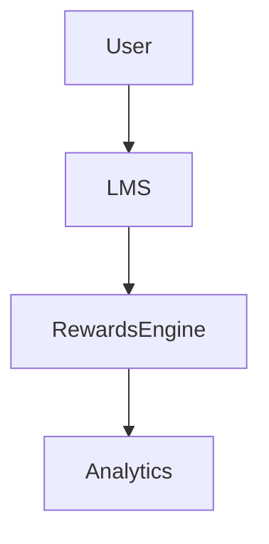

# Quick Start: Overview

Welcome to Rocket Learning Rewards! Rocket learning Rewards is a system that allows learners to earn points and rewards for completing educational activities. The platform provides a loyalty program with tracking and redemption capabilities. We integrate with whatever platform you're using to track specific metrics that you want to track, learners achieve reward points for positive and meaningful engagement. Learners then redeem their points through a variety of rewards partners we work with. 

Higher rewards points unlocks better rewards and more importantly, means better engagement in your courses or trainings.  

## Architecture Diagram

## 📺 Watch This First
> 
