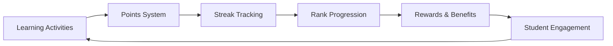
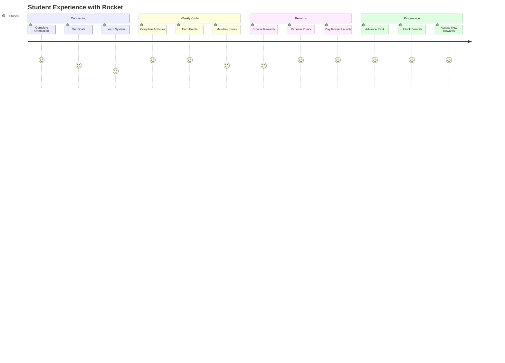

# Getting Started with Rocket

Rocket is an educational rewards system designed to incentivise positive Learner engagement in learning management systems (LMS). The platform provides points-based rewards for academic activities and allows Learner to redeem points for real-world rewards and discounts. 

## Target Users
- **Learners:** Primary users earning and redeeming points 
- **Learning Managers:** Monitor Learner engagement and progress 

## What You'll Learn

-   :rocket:{ .lg .middle } **Platform Overview**

    ---

    Understand Rocket's core concepts and how it enhances student engagement.

    [:octicons-arrow-right-24: Learn the Basics](#core-concepts)

-   :gear:{ .lg .middle } **Installation**

    ---

    Step-by-step guide to set up Rocket in your environment.

    [:octicons-arrow-right-24: Installation Guide](installation.md)

-   :electric_plug:{ .lg .middle } **First Integration**

    ---

    Connect your LMS and configure your first reward system.

    [:octicons-arrow-right-24: Quick Setup](quick-start.md)

-   :chart_with_upwards_trend:{ .lg .middle } **Configuration**

    ---

    Customize Rocket to match your institution's needs.

    [:octicons-arrow-right-24: Basic Configuration](configuration.md)

## Core Concepts

Before diving into implementation, let's understand Rocket's fundamental concepts:

### The Rocket Ecosystem

### Key Components

=== "Points System"
    Students earn points for various learning activities:
    
    - **Course Module Views**: 25 points
    - **Discussion Posts**: 50 points
    - **Quiz Completions**: 100 points
    - **Assignment Submissions**: 150 points
    - **Survey Completions**: 100 points

=== "Streak System"
    Consecutive weeks of achieving weekly point goals:
    
    - Encourages consistent engagement
    - Unlocks rank progression
    - Provides bonus rewards
    - Builds learning habits

=== "Rank System"
    Three progressive tiers with increasing benefits:
    
    | Rank | Requirement | Benefits |
    |------|-------------|----------|
    | **Explorer** | 0-3 weeks | Basic discounts |
    | **Pilot** | 4-6 weeks | Enhanced rewards |
    | **Commander** | 7+ weeks | Premium benefits |

=== "Reward System"
    Real-world incentives through Tillo integration:
    
    - Gift cards from major brands
    - Percentage discounts
    - Rocket Launch lottery entries
    - Exclusive commander benefits

## How Rocket Works

### Student Journey

### Administrator Workflow

1. **Setup**: Configure organisation settings and user management
2. **Integration**: Connect LMS and configure event triggers
3. **Customisation**: Set point values, rewards, and limits
4. **Monitoring**: Track engagement and financial metrics
5. **Optimisation**: Adjust settings based on analytics

## Prerequisites

Before implementing Rocket, ensure you have:

!!! note "Technical Requirements"
    - **LMS**: Moodle, OpenLMS, or LearnWorlds instance
    - **AWS Account**: For hosting and infrastructure
    - **Tillo Account**: For reward fulfillment
    - **Domain**: For custom branding
    - **Email Service**: For notifications

!!! warning "Access Requirements"
    - Administrator access to your LMS
    - Ability to install plugins (for Moodle/OpenLMS)
    - API access credentials
    - Financial approval for reward budgets

## Next Steps

Ready to get started? Follow our implementation guide:

1. **[Installation](installation.md)**: Set up the technical infrastructure
2. **[Quick Start](quick-start.md)**: Configure your first integration
3. **[Configuration](configuration.md)**: Customise for your institution
4. **[Testing](testing.md)**: Validate your implementation

## Getting Help

Need assistance? We're here to help:

- **Documentation**: Comprehensive guides and references
- **Support Team**: Technical assistance for implementation
- **Community**: Connect with other Rocket users
- **Training**: Scheduled sessions for administrators

---

Ready to transform student engagement? Let's launch your Rocket implementation! 🚀